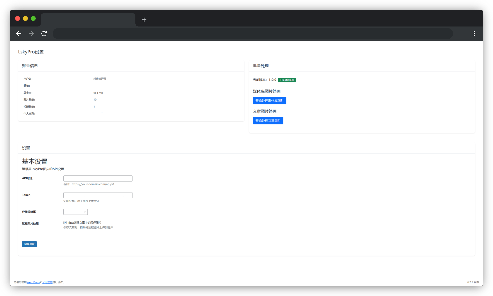

<h1 align="center">LskyPro For WordPress</h1>

  

## 插件介绍

LskyPro For WordPress 是一个专为 WordPress 设计的图床插件，可以自动将 WordPress 上传的图片同步到 LskyPro 图床。通过使用此插件，您可以有效减轻服务器存储压力，提高图片加载速度，并且更好地管理您的媒体资源。 ✨

## 主要功能

- **自动同步** 上传到 WordPress 的图片会自动同步到 LskyPro 图床
- **远程图片处理** 可以自动将文章中的远程图片上传到图床
- **批量处理** 支持批量处理媒体库和文章中的图片
- **自定义存储策略** 支持选择 LskyPro 的不同存储策略
- **计划任务** 支持通过 Cron 任务定期处理图片
- **状态显示** 在媒体库中显示图片的图床状态
- **安全可靠** 使用 WordPress 安全机制，确保数据传输安全

## 安装方法

1. 下载插件压缩包 
2. 在 WordPress 后台进入"插件"页面，点击"上传插件" 
3. 选择下载的压缩包并安装 
4. 激活插件 
5. 按照设置向导完成配置 

## 配置说明

### 基础配置 

1. 激活插件后，会自动跳转到设置向导
2. 输入 LskyPro 图床的 API 地址 
3. 输入 Token 
4. 点击"保存配置"完成基础设置 

### 计划任务配置 

1. 基础配置完成后，会进入计划任务配置页面
2. 设置 Cron 密码用于安全验证 
3. 根据页面提示设置系统计划任务 
4. 测试计划任务是否正常运行 
5. 完成设置 

## 使用说明

### 媒体上传 

插件激活后，所有上传到 WordPress 的图片都会自动同步到 LskyPro 图床。您可以在媒体库中查看图片的图床状态。

### 远程图片处理 

1. 在插件设置页面启用"自动处理文章中的远程图片"选项 
2. 保存文章时，插件会自动将文章中的远程图片上传到图床 

### 批量处理 

1. 在插件设置页面的"批量处理"选项卡中 
2. 选择"处理媒体库图片"或"处理文章图片" 
3. 点击"开始处理"按钮 
4. 等待处理完成 

## 常见问题

### 图片上传失败怎么办？

- 检查 LskyPro 图床 API 地址是否正确 
- 确认 Token 是否有效 
- 查看 WordPress 错误日志获取详细信息 

### 计划任务不工作怎么办？

- 确认系统 Cron 服务是否正常运行 
- 检查 Cron 命令是否正确设置 
- 验证 Cron 密码是否正确 

### 如何更改存储策略？

在插件设置页面的"设置"选项卡中，可以选择不同的存储策略。

## 版权信息

- 作者：LittleSheep 
- 作者网站：[https://www.littlesheep.cc](https://www.littlesheep.cc) 
- 插件版本：1.0.0 

感谢您使用 LskyPro For WordPress 插件！